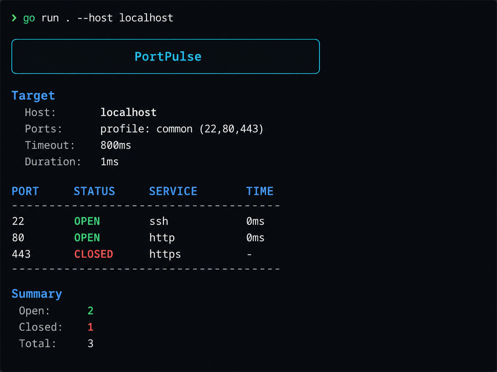

# ⚡ PortPulse

<p align="center">
  
</p>

<p align="center">
  <b>Colorful TCP port scanner and network diagnostic CLI tool written in Go.</b>
</p>

<p align="center">
  
  
  
  
</p>

---

## 📌 About

**PortPulse** is a lightweight TCP port scanner for developers.

It helps you quickly check which ports are open or closed on your own machine, VPS, server, or development environment.

You can use it to quickly answer questions like:

- Is SSH open on my server?
- Is my local Vite dev server running?
- Are PostgreSQL, Redis, or MongoDB exposed?
- Are HTTP/HTTPS ports reachable?
- Which ports are open in a specific range?

> ⚠️ Use PortPulse only on hosts you own or have permission to test.

---

## ✨ Features

- 🎯 Scan selected TCP ports
- 📦 Scan port ranges like `20-100`
- 🧩 Built-in profiles: `common`, `web`, `db`, `dev`
- ⚡ Concurrent scanning with goroutines
- 🎨 Colorful terminal output
- 🧠 Common service name detection
- ⏱️ Custom connection timeout
- 🧼 Duplicate port cleanup and sorted results
- 🛠️ Simple single-file Go CLI project

---

## 🚀 Quick Start

### 1. Clone the repository

```bash
git clone https://github.com/notimechoki/portpulse.git
cd portpulse
```

---

### 2. Run with Go

```bash
go run . --host localhost
```

This scans `localhost` using the default profile:

```text
common → 22,80,443
```

---

### 3. Build binary

```bash
go build -o portpulse
```

Run the compiled binary:

```bash
./portpulse --host localhost
```

---

## 🧪 Usage Examples

### ✅ Default scan

```bash
go run . --host localhost
```

Scans `localhost` with the default `common` profile.

The `common` profile checks:

```text
22,80,443
```

Useful for a quick basic check:

- `22` → SSH
- `80` → HTTP
- `443` → HTTPS

---

### 🌐 Web profile

```bash
go run . --host localhost --profile web
```

Scans common web and local development ports:

```text
80,443,3000,5000,5173,8000,8080
```

Useful when checking frontend/backend development servers:

- `3000` → common React/Node dev port
- `5173` → default Vite dev port
- `8000` → common backend dev port
- `8080` → common alternative HTTP port

---

### 🗄️ Database profile

```bash
go run . --host localhost --profile db
```

Scans common database ports:

```text
3306,5432,6379,27017
```

Useful for checking local database services:

- `3306` → MySQL/MariaDB
- `5432` → PostgreSQL
- `6379` → Redis
- `27017` → MongoDB

---

### 🧰 Development profile

```bash
go run . --host localhost --profile dev
```

Scans a mixed set of common development ports:

```text
22,80,443,3000,5000,5173,5432,6379,8000,8080
```

Useful when you want to quickly understand what is currently running on your development machine.

---

### 🎯 Scan selected ports

```bash
go run . --host localhost --ports 80,443
```

Scans only the ports you specify.

This is useful when you know exactly what you want to check.

---

### 📦 Scan a port range

```bash
go run . --host localhost --ports 20-100
```

Scans every port from `20` to `100`.

Useful for checking a small range of system/network ports.

---

### ⏱️ Custom timeout

```bash
go run . --host localhost --ports 20-100 --timeout 1s
```

Sets the connection timeout to `1s`.

Examples:

```bash
--timeout 500ms
--timeout 1s
--timeout 2s
```

Short timeout = faster scan, but potentially less reliable on slow networks.

Long timeout = slower scan, but better for unstable/remote hosts.

---

## 🧩 Available Profiles

| Profile | Ports | Use case |
|---|---:|---|
| `common` | `22,80,443` | Basic server check |
| `web` | `80,443,3000,5000,5173,8000,8080` | Web/frontend/backend dev ports |
| `db` | `3306,5432,6379,27017` | Common database ports |
| `dev` | `22,80,443,3000,5000,5173,5432,6379,8000,8080` | General development machine check |

---

## 🖥️ Example Output

```text
╭──────────────────────────────────────────────╮
│                  PortPulse                   │
╰──────────────────────────────────────────────╯

Target
  Host:      localhost
  Ports:     profile: web (80,443,3000,5000,5173,8000,8080)
  Timeout:   800ms
  Duration:  805ms

PORT     STATUS     SERVICE        TIME
──────────────────────────────────────────────
80       CLOSED     http           -
443      CLOSED     https          -
3000     CLOSED     unknown        -
5000     CLOSED     unknown        -
5173     OPEN       unknown        0ms
8000     CLOSED     dev-http       -
8080     CLOSED     dev-http       -
──────────────────────────────────────────────

Summary
  Open:    1
  Closed:  6
  Total:   7
```

---

## ⚙️ How It Works

PortPulse checks ports by trying to open a TCP connection:

```go
net.DialTimeout("tcp", address, timeout)
```

If the connection is successful, the port is marked as:

```text
OPEN
```

If the connection fails, times out, or is refused, the port is marked as:

```text
CLOSED
```

The scanner runs checks concurrently using goroutines, so scanning multiple ports is fast and simple.

---

## 📁 Project Structure

```text
portpulse/
├── go.mod
├── main.go
├── README.md
├── .gitignore
└── assets/
    └── portpulse-demo.png
```

### `main.go`

Contains the whole CLI application:

- CLI flags
- profile handling
- port parsing
- TCP scanning
- colorful report output

### `README.md`

Project documentation.

### `assets/`

Contains images used in the README.

---

## 🛠️ Commands

### Format code

```bash
gofmt -w main.go
```

### Run project

```bash
go run . --host localhost
```

### Build binary

```bash
go build -o portpulse
```

### Run binary

```bash
./portpulse --host localhost --profile web
```

---

## 🔐 Responsible Usage

PortPulse is intended for:

- local development
- personal VPS/server checks
- debugging your own infrastructure
- learning Go networking basics

Do not use it to scan systems without permission.

---

## 📄 License

MIT License.
